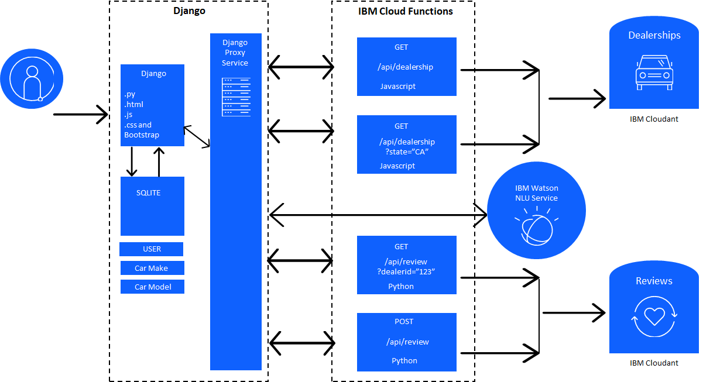

# Capstone Project

This is IBM Full Stack Developer Specialization Capstone Project built by me. The Application's Architecture is provided by IBM but the code is written by me.

## Solution architecture
The solution will consist of multiple technologies

1. The user interacts with the Django application through a web browser.
2. The Django application handles the user authentication using the SQLite database as the persistance layer.
3. The SQLite database also stores the Car Make and the Car Model data.
4. The dealerships and the reviews are stored in Cloudant, a NoSQL document based database.
5. IBM Cloud functions are used to interface with the Cloudant database to get dealerships, get reviews and post reviews.
6. The Django application talks to the IBM Cloud Functions via a set or proxy services.

